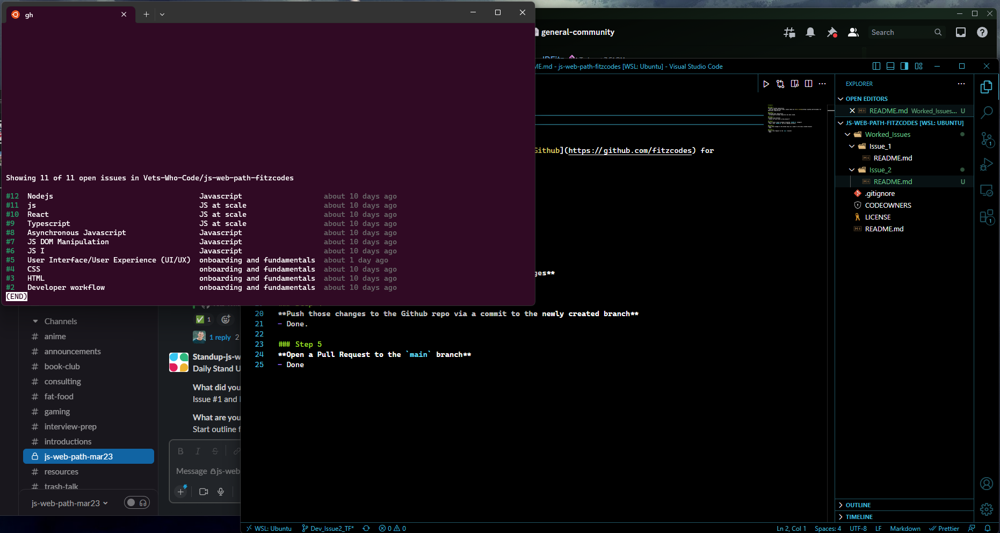

# Issue 2

### Step 1
**Create a Github repository**
- This has been done many times, please check out [Fitz's Github](https://github.com/fitzcodes) for additional repositories.

### Step 2
**Download that repository**
- js-web-path-fitzcodes repository has been cloned. 

### Step 3
**Create a git branch**
- Branch for this issue is Dev_Issue2_TF

### Step 4
**Use vs-code to add 3 markdown formatted `README.md` changes**
- That's this `README.md` you are reading currently. 

### Step 5
**Push those changes to the Github repo via a commit to the newly created branch**
- Done.

### Step 6
**Open a Pull Request to the `main` branch**
- Done

## Proof of conditions met
- *vs-code installed*
- *`github` cli installed*
- *`github` cli configured with user profile*

